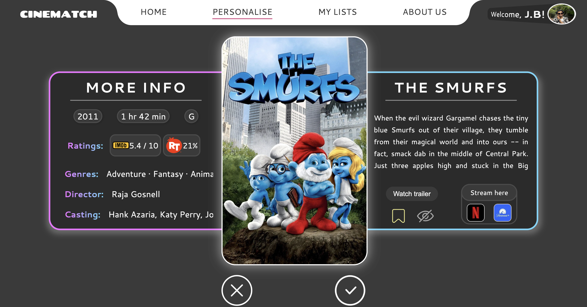
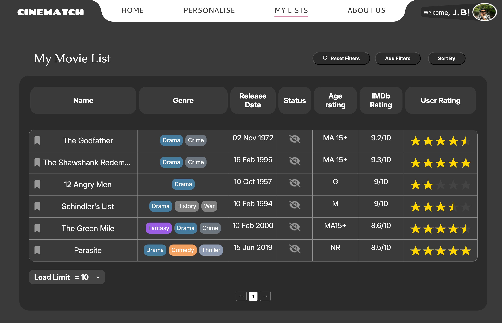

## 🎬 Cinematch

Cinematch is a full-stack web application that simplifies the process of discovering movies and TV shows. Aimed at casual viewers and entertainment enthusiasts, the app offers a fast, fun, and personalised experience.

Users can like or dislike content, and Cinematch learns their preferences to provide tailored recommendations. With features like easy sign-up/login, trending content exploration, swipe-based discovery, personal watchlists, user ratings, dark/light theme toggle, and admin management, Cinematch delivers a seamless and engaging way to find what to watch next.


## 📚 Table of Contents
  
- [🎬 Cinematch](#cinematch)
- [📚 Table of Contents](#table-of-contents)
- [🧰 Project Structure](#project-structure)
- [✨ Features](#features)
- [🚀 Usage](#🚀usage)
- [🔑 API Keys & .env Setup](#api-keys--env-setup)
- [👨🏻‍💼 Dummy Data](#dummy-data)
- [🛠️ Makefile Targets](#makefile-targets)
- [🔒 Security Notes](#security-notes)
- [📦 Technologies Used](#technologies-used)
- [📈 Future Improvements](#future-improvements)
- [📸 Screenshots](#screenshots)


## 🧰 Project Structure

```
cinematch/
├── .devcontainer/        # Devcontainer and dotfiles to setup developer environment
├── .gitignore
├── Makefile              # Useful commands for setup and dev
├── README.md
├── docs/                 # Documentation
├── backend/              # Express backend with routes, services, db
│   ├── app.js
│   ├── bin/
│   ├── db/               # Contains schema.sql, seed.sql, views.sql
│   ├── .env              # Environment variables for DB and backend
│   ├── package.json
│   ├── routes/
│   ├── services/
│   ├── uploads/          # User-uploaded profile images
│   └── views/
└── frontend/             # Static frontend files (HTML, CSS, JS)

```


## ✨ Features

- 🎯 Personalized movie & TV discovery based on user preferences
- 🏠 Homepage with trending & top-rated content
- 📱 Swipe discovery interface
- 🔍 Search functionality for titles
- 📄 Detail pages with full media information
- 📋 Personalised watchlist with status and ratings
- 👤 Secure user authentication (login/signup)
- 🎛️ Filter, sort, rate, and manage user content
- 👑 Admin dashboard to manage users and content
- 🖼️ Profile picture upload
- 🌗 Dark / Light mode


## 🚀 Usage

### 🔧 Initial Setup (Local Development)

1. **Clone the repo:**

   ```bash
   git clone https://github.com/joebyjo/cinematch.git
   cd cinematch
   ```

2. Create `.env`
    ```bash
    cp backend/.env.example backend/.env
    # fill in TMDB, OMDB keys, cookie secret, and DB credentials
    ```

3. **Open in Dev Container in Visual Studio Code.**
    - Use “Reopen in Container” if prompted, or manually open the folder in a Dev Container.

4. **Run the following commands:**

   ```bash
   make install       # installs backend dependencies
   make db-reset      # creates, seeds, and sets up views in MySQL DB
   make start         # runs the app using npm
   ```

5. Open your browser and go to:

   🔗 `http://localhost:8080`


## 🔑 API Keys & .env Setup

To use the TMDB and OMDB APIs, you'll need to add API keys to your `.env` file:

```bash
# environment type
NODE_ENV=prod

# api keys
TMDB_API_KEY=your_tmdb_key_here
OMDB_API_KEY=your_omdb_key_here

# cookie secret
COOKIE_SECRET=your_cookie_secret

# database
DB_HOST=localhost
DB_PORT=3306
DB_NAME=your_db_name
DB_USER=your_mysql_user
DB_PASS=your_mysql_password

# app port
APP_PORT=8080
```

You can obtain keys from:

- 🔗 [TMDB API Key](https://www.themoviedb.org/settings/api)
- 🔗 [OMDB API Key](https://www.omdbapi.com/apikey.aspx)


## 👨🏻‍💼 Dummy Data

Use the following credentials to explore the app’s functionality:

| Role  | Username | Password   |
| ----- | -------- | ---------- |
| Admin | joe      | Ab_123456  |
| User  | hiten    | Ab_123456  |
| User  | josheen  | Ab_123456  |
| User  | liri     | Ab_123456  |


## 🛠️ Makefile Targets

| Target           | Description                                                             |
| ---------------- | ----------------------------------------------------------------------- |
| `make install`   | Installs backend dependencies, starts MySQL, and sets root password     |
| `make start`     | Starts the Express backend in production mode                           |
| `make dev`       | Starts the backend using `nodemon` for hot reloading during development |
| `make mysql`     | Opens a MySQL shell to the database                                     |
| `make db-start`  | Starts the MySQL server                                                 |
| `make db-create` | Creates the database schema and views from SQL scripts                  |
| `make db-seed`   | Seeds the database with initial data                                    |
| `make db-dump`   | Dumps the current state of the database to `dump.sql`                   |
| `make db-reset`  | Drops the DB, recreates schema/views, and seeds it all in one step      |


## 🔒 Security Notes

- 🔐 Passwords hashed using `bcrypt`
- ⚙️ Environment variables loaded via `dotenv`
- 🚫 SQL Injection protection via parameterized queries
- ✅ Data sanitization via `express-validator` & `xss-clean`
- 🧠 Session handling with `express-session` & `express-mysql-session`
- 🔑 Authentication enforced via Passport.js middleware


## 📦 Technologies Used

### ⚙️ Backend:

- **Node.js**, **Express.js**
- **MySQL**, **express-session**, **express-mysql-session**
- **Passport.js** for authentication
- **bcrypt**, **dotenv**, **express-validator**, **xss-clean**
- **Axios** for external API requests
- **Makefile**, **Nodemon** for tooling

### 💻 Frontend:

- **HTML5**, **CSS3**, **Vue.js**
- **Vanilla JavaScript** (modularised with ES6 modules)


## 📈 Future Improvements
- add support for TV Shows
- Unit testing
- Documentation
- Party mode for Personalise
- Shareable playlists
- Streaming


## 📸 Screenshots




